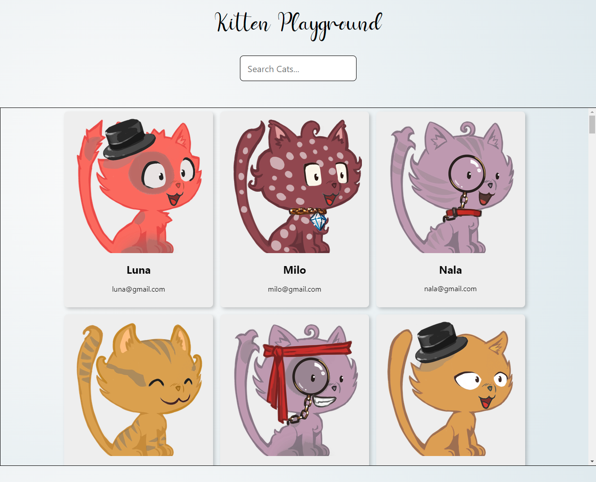

# Kitten Playground

Project Link: (danielphandptp.github.io/images-search/)

Installation steps:
1. `git clone <project-url>`
2. `npm install`
3. `npm run start`

Simply type in the search box to see how React.js render the components.

